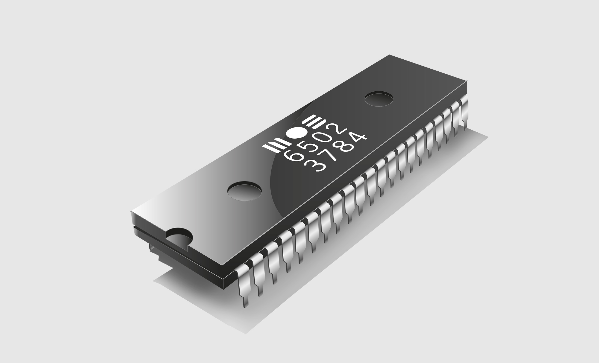

# mos6502




[](https://docs.rs/mos6502)

An emulator for the [MOS 6502 CPU](https://en.wikipedia.org/wiki/MOS_Technology_6502) written in Rust.  
It builds on stable Rust and supports `#[no_std]` targets.

## What is the MOS 6502?

> The MOS Technology 6502 (typically pronounced "sixty-five-oh-two" or "six-five-oh-two") is an 8-bit microprocessor that was designed by a small team led by Chuck Peddle for MOS Technology. [...]
>
> When it was introduced in 1975, the 6502 was the **least expensive microprocessor on the market** by a considerable margin. It initially sold for less than one-sixth the cost of competing designs from larger companies, such as the 6800 or Intel 8080. Its introduction caused rapid decreases in pricing across the entire processor market. **Along with the Zilog Z80, it sparked a series of projects that resulted in the home computer revolution of the early 1980s.**

Source: [Wikipedia](https://en.wikipedia.org/wiki/MOS_Technology_6502)


## How to use this library

```rust
use mos6502::cpu;

fn main() {
    // Calculate the greatest common divisor of 56 and 49
    // using Euclid's algorithm.
    let zero_page_data = [56, 49];

    let program = [
        // (F)irst | (S)econd
        // .algo
        0xa5, 0x00,       // Load from F to A
        // .algo_
        0x38,             // Set carry flag
        0xe5, 0x01,       // Substract S from number in A (from F)
        0xf0, 0x07,       // Jump to .end if diff is zero
        0x30, 0x08,       // Jump to .swap if diff is negative
        0x85, 0x00,       // Load A to F
        0x4c, 0x12, 0x00, // Jump to .algo_
        // .end
        0xa5, 0x00,       // Load from S to A
        0xff,
        // .swap
        0xa6, 0x00,       // load F to X
        0xa4, 0x01,       // load S to Y
        0x86, 0x01,       // Store X to F
        0x84, 0x00,       // Store Y to S
        0x4c, 0x10, 0x00, // Jump to .algo
    ];

    let mut cpu = cpu::CPU::new();

    cpu.memory.set_bytes(0x00, &zero_page_data);
    cpu.memory.set_bytes(0x10, &program);
    cpu.registers.program_counter = 0x10;

    cpu.run();

    // The expected GCD is 7
    assert_eq!(7, cpu.registers.accumulator);
}
```

## Credits

This started off as a fork of [amw-zero/6502-rs](https://github.com/amw-zero/6502-rs),
which seems to be [unmaintained](https://github.com/amw-zero/6502-rs/pull/36) at this point.
